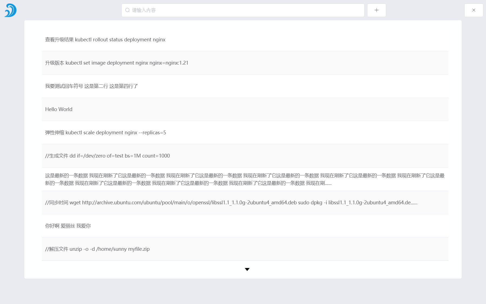
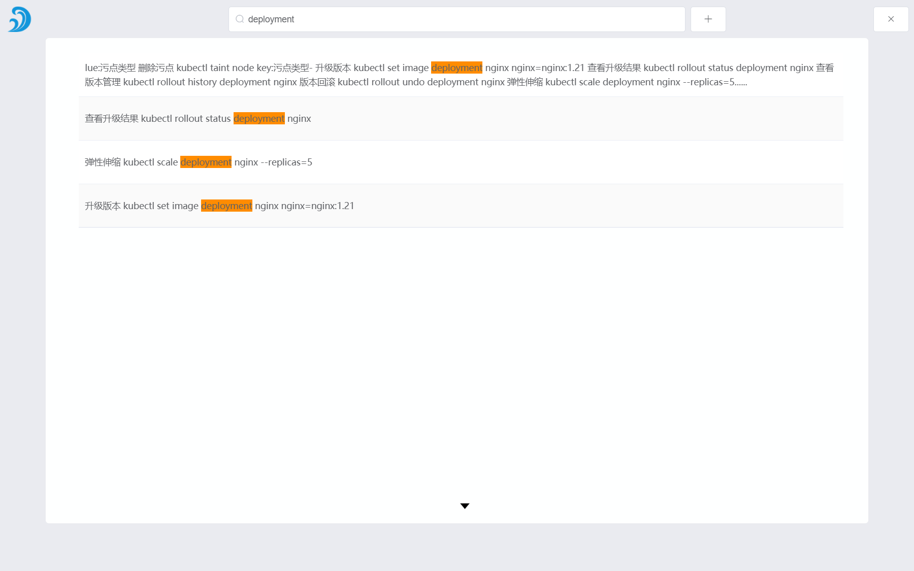
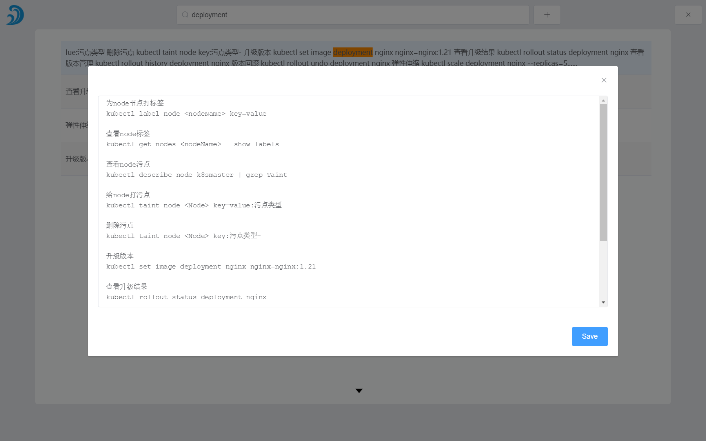

# exhale
> 呼之欲出的工具

一款使用node.js 开发的windows桌面应用，轻量、便捷、高颜值，可以加快工作效率。

## Build Setup

``` bash
# 安装依赖
npm install

# 运行dev环境
yarn run dev

#打包
yarn run build
```
---
## Demo

---

---

---

## 快捷键

``` bash
# 呼出主页面
Alt + 1

# 隐藏到托盘
Alt + 2
```

## Download
Windows: [app release]()